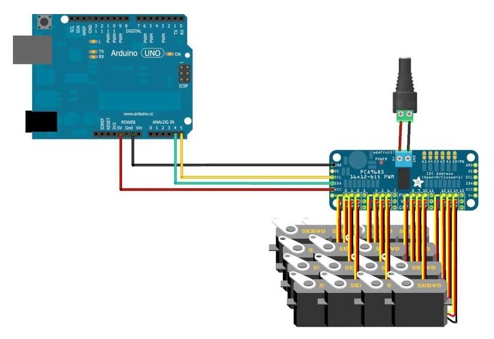

# Robotic Hand Controller

A servo-controlled robotic hand project using Arduino and PCA9685 PWM driver, designed for 8 Tower Pro SG90 micro servos.

## 🔧 Hardware Requirements

- **Arduino Uno/Nano/ESP32** (any compatible board)
- **PCA9685 16-Channel PWM Driver**
- **8x Tower Pro SG90 Micro Servos**
- **5V Power Supply** (2-3A recommended for 8 servos)
- **Jumper wires**
- **Breadboard** (optional)

## 📋 Features

- Control up to 8 servos individually
- Multi-servo commands for coordinated movement
- Serial command interface
- Optimized for Tower Pro SG90 servos
- Real-time servo positioning

## 🔌 Wiring Diagram



*Complete wiring diagram showing Arduino Nano, PCA9685, and 8 SG90 servos*


### Arduino Nano to PCA9685 Connection
```
Arduino Nano    PCA9685
------------    -------
    5V      →     VCC
   GND      →     GND
    A4      →     SDA
    A5      →     SCL
```

### Power Supply Connection
```
Power Supply    PCA9685
------------    -------
     5V     →     V+
    GND     →     GND (common with Arduino GND)
```

### Servo Connections (SG90)
```
PCA9685         SG90 Servos
-------         -----------
  PWM 0     →   Servo 0 (Signal - Orange/Yellow)
  PWM 1     →   Servo 1 (Signal - Orange/Yellow)
  PWM 2     →   Servo 2 (Signal - Orange/Yellow)
  PWM 3     →   Servo 3 (Signal - Orange/Yellow)
  PWM 4     →   Servo 4 (Signal - Orange/Yellow)
  PWM 5     →   Servo 5 (Signal - Orange/Yellow)
  PWM 6     →   Servo 6 (Signal - Orange/Yellow)
  PWM 7     →   Servo 7 (Signal - Orange/Yellow)

All Servo Power (Red)   → PCA9685 V+
All Servo Ground (Brown)→ PCA9685 GND
```


*Detailed connection overview*

### SG90 Servo Wire Colors
- **Orange/Yellow**: Signal (PWM)
- **Red**: Power (+5V)
- **Brown/Black**: Ground

## 📚 Required Libraries

Install these libraries through Arduino IDE Library Manager:

```cpp
#include <Wire.h>                    // I2C communication (built-in)
#include <Adafruit_PWMServoDriver.h> // PCA9685 driver
```

## 🚀 Installation

1. **Clone this repository**
   ```bash
   git clone https://github.com/yourusername/robotic-hand-controller.git
   cd robotic-hand-controller
   ```

2. **Install required libraries**
   - Open Arduino IDE
   - Go to Tools → Manage Libraries
   - Search and install: "Adafruit PWM Servo Driver Library"

3. **Wire your hardware** according to the diagram above

4. **Upload the code** to your Arduino

## 💻 Usage

### Serial Commands

Connect to the Arduino via Serial Monitor (115200 baud) and use these commands:

#### Single Servo Control
```
SERVO,ID,ANGLE
```
- **ID**: Servo number (0-7)
- **ANGLE**: Target angle (0-180°)

**Examples:**
```
SERVO,0,90    // Move servo 0 to 90 degrees
SERVO,3,0     // Move servo 3 to 0 degrees
SERVO,7,180   // Move servo 7 to 180 degrees
```

#### Multi-Servo Control
```
MULTI,ID1,ANGLE1,ID2,ANGLE2,...
```

**Examples:**
```
MULTI,0,90,1,45,2,135           // Move multiple servos simultaneously
MULTI,0,0,1,0,2,0,3,0,4,0       // Reset first 5 servos to 0 degrees
```

### Response Codes
- `OK`: Command executed successfully
- `ERROR: Invalid servo ID or angle`: Invalid parameters
- `ERROR: Unknown command`: Unrecognized command format

## ⚙️ Configuration

### Servo Calibration (Tower Pro SG90)
The code is pre-configured for SG90 servos with these pulse widths:
```cpp
#define SERVOMIN  204   // ~1ms pulse (0°)
#define SERVOMAX  409   // ~2ms pulse (180°)
```

### Adjusting for Different Servos
If using different servos, modify these values:
```cpp
#define SERVOMIN  150   // Minimum pulse length
#define SERVOMAX  600   // Maximum pulse length
```

## 🔧 Troubleshooting

### Servos Not Moving Full Range
- Check power supply (5V, 2-3A minimum)
- Verify SERVOMIN/SERVOMAX values for your servo type
- Ensure all connections are secure

### Servos Jittery or Erratic
- Check power supply capacity
- Verify common ground between Arduino and power supply
- Reduce simultaneous servo movements

### No Response to Commands
- Check Serial connection (115200 baud)
- Verify I2C connections (SDA/SCL)
- Check PCA9685 power connections

## 📈 Future Improvements

- [ ] Add servo position feedback
- [ ] Implement predefined hand gestures
- [ ] Add smooth movement interpolation
- [ ] Web interface for remote control
- [ ] Save/load servo positions to EEPROM

## 📄 License

This project is licensed under the MIT License - see the [LICENSE](LICENSE) file for details.

## 🤝 Contributing

1. Fork the repository
2. Create a feature branch (`git checkout -b feature/AmazingFeature`)
3. Commit your changes (`git commit -m 'Add some AmazingFeature'`)
4. Push to the branch (`git push origin feature/AmazingFeature`)
5. Open a Pull Request

## 📞 Support

If you encounter any issues:
1. Check the troubleshooting section above
2. Open an issue on GitHub with details about your setup
3. Include serial monitor output if applicable

---

**Happy Building! 🤖**